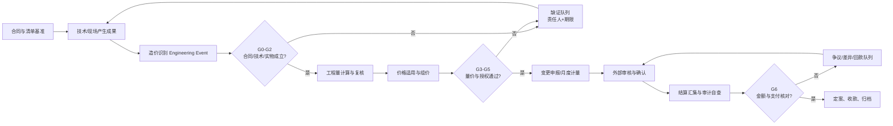

# 施工项目工程造价成果与审计工作流

> 适用对象：施工总承包项目的项目经理、造价经理、造价员。
> 产品定位：BuildCostIQ 只负责与金额有关的事实汇集、验证、定价、确认和归档；技术、生产、质量、测量、试验、物资等岗位仍在各自工具中形成专业成果。

## 1. 专家结论

施工项目造价不是所有工程事实的生产者，而是项目金额事实的**汇集者、验证者和守门人**。

技术和现场岗位先生成并完善工作成果；造价把成果映射到合同、清单和工程事件，检查其可计量、可计价、已授权、可结算程度；项目经理对责任、资源和重大商业事项作决策。最终结算资料不是竣工时临时拼装的一摞文件，而是施工过程中逐个工程事件闭合后的累计结果。

每一笔结算金额都应能反向回答：

```text
为什么可以计取（合同/法定依据）
  ← 做了什么（批准范围和技术边界）
  ← 是否真实完成（现场、质量、验收证据）
  ← 数量是多少（可复算的工程量底稿）
  ← 单价如何形成（合同单价/组价/价格依据）
  ← 谁已确认（权限、时限、签章和状态）
  ← 是否已计量、结算和收款（财务核对）
```

BuildCostIQ 的最小核心对象是：

```text
合同基准 + Engineering Event + Evidence + 量价底稿 + 审批 + Outcome
```

## 2. 公开资料和 GitHub 蒸馏

### 2.1 审计要求

公开审核规则把真实性、合法性、完整性作为编报责任，并要求审核过程和结果进入工作底稿。审核资料包括招投标文件、合同、施工图或竣工图、工程量计算书、材料价格、取费、付款、施工组织设计、变更签证、隐蔽工程和财务资料；结算审核重点关注工程量与规则、计价、设计变更、现场签证、材料设备价格、政策变化和补充合同。必要时还需现场查勘，对图纸、实物量、材料或合同不一致取得证据和签证。[财政部审核暂行办法（政府转载）](https://www.bypc.gov.cn/zfxxgk/bmdwxzjd/bmdw/qsjj/fdzdgknr/lzyj/zcfg/art/2025/art_5480680297ad4fc6ba51b6f2a3f7447c.html)

地方政府公开的竣工结算管理规则进一步把审核项拆成资料完整性、工程量、计价、变更签证、甲供材与设备、暂估价、罚款与违约扣款、争议和风险提示。[杭州市政府投资项目竣工结算管理办法示例](https://zjjcmspublic.oss-cn-hangzhou-zwynet-d01-a.internet.cloud.zj.gov.cn/jcms_files/jcms1/web3549/site/attach/0/538bcea1a79e41458d8864b1beae56ce.pdf)

由此提炼出七道审计闸门：**合同有效、技术有效、实物真实、质量合格、数量可复算、价格有依据、授权与支付可核对**。

### 2.2 开源项目的可复用思想

| 项目 | 蒸馏结果 | 本项目不复制的部分 |
| --- | --- | --- |
| [OpenTakeoff](https://github.com/Kentucky-ai/opentakeoff) | 每个算量图形保留比例、生成方法、人工修订和原始边界；Agent 只能建议，人工才可批准；结果附标注图 | 不在 Core 内重建 PDF/CAD 算量画布 |
| [OpenConstructionERP](https://github.com/datadrivenconstruction/OpenConstructionERP) | BOQ 与 CAD/BIM 来源相连；工程量保留来源参数；图档有版本；变更同时表达造价和工期影响 | 不扩张为综合 ERP、计划或财务系统 |
| [SiteScribe](https://github.com/muratyanasoglu/SiteScribe) | 日志、RFI、图纸修订和照片先形成 Evidence，再生成 Event 和变更草案；导出包带引用和哈希 | 不引入多租户、邮件和通用协同平台 |

公开行业实践同样强调“采集、批准、可计费”必须分开：AI 可以整理证据和指出缺口，但范围、价格、法律风险与客户承诺由具名责任人确认。[Fabren 变更证据工作流](https://www.fabrenhq.com/blog/ai-construction-change-order-intake-workflow)

### 2.3 Build Decision

- **分类：Improve。** 现有方案分别覆盖综合 ERP、算量或变更证据，但缺少面向中国施工项目、以最终结算可审计性为终点的轻量造价闭环。
- **可测差异：** 任一结算行能从一个入口反查七道闸门；未闭合事件明确缺什么、谁补、何时复核；Core 不重复生成技术和 CAD 专业成果。
- **最小核心：** 合同基准、工程事件、证据、量价、变更、计量、结算、回款和审计轨迹。
- **明确不建：** 综合 OA、进度计划软件、质量安全系统、物资仓储、CAD 编辑器、会计总账、第二套金额台账。

## 3. 施工全过程造价成果地图

### A. 合同与计价基准

**目标：** 固定“按什么范围、规则和价格结算”。

| 必备成果 | 主要形成者 | 造价审查点 |
| --- | --- | --- |
| 招投标与合同资料索引 | 造价员 | 文件有效、版本唯一、可追溯 |
| 合同计价与风险交底 | 造价经理 | 范围、价款模式、调价、签证、索赔、计量、时限、付款、争议 |
| 合同清单基准 | 造价员 | 项目特征、单位、数量、单价、合价、暂列/暂估 |
| 合同范围边界表 | 技术负责人 + 造价经理 | 包含项、排除项、界面和甲供项 |
| WBS/部位/清单映射 | 造价员 | 一物一码、层级稳定 |
| 责任与审批矩阵 | 项目经理 | 金额权限、签字权限、时限和升级规则 |
| 风险与机会清单 | 造价经理 | 责任、通知期限、证据要求 |

**出口条件：** 合同基准未确认，不得将后续数字认定为偏差、变更或可结算金额。

### B. 技术成果转成可计量边界

| 上游成果 | 主要形成者 | 造价接收的最小字段 |
| --- | --- | --- |
| 有效施工图、会审、设计交底 | 技术/设计 | 图号、版次、有效日期、替代关系、适用部位 |
| 施工方案与技术核定 | 技术负责人 | 方法、材料、构造、措施、范围、批准状态 |
| 设计变更、洽商、RFI 回复 | 设计/建设/技术 | 变更前后范围、原因、责任、日期、授权 |
| 测量成果和现场草图 | 测量 | 坐标/里程/标高、部位、日期、人员、复核人 |
| CAD/BIM 算量包 | 算量工具 | 文件哈希、图纸版本、比例/规则、几何位置、数量、单位、操作者、复核状态 |

造价不得替代技术负责人批准方案或图纸。工具输出先作为 `Observation`；版本、范围和责任确认后成为技术 `Fact`，才能进入量价计算。

### C. 目标成本与零号台账

形成施工图预算/预计收入、目标成本、分包和采购控制价、主要资源量价、合同清单与施工预算差异、开源节流责任项、现金流测算和风险预备项。

审计要点：基线日期与版本明确；收入和成本分开；暂列、暂估与风险单列；数量和价格分别留底；修订保留旧版本和原因。

开工前固定执行六项造价策划检查：招标与中标资料清标、中标清单结构化、施工图及工程量依据、0#台账、中标价与市场价同口径比较、人工/材料/机械消耗量与量价汇总。施工过程发生图纸、方案、价格或实际消耗变化时，以事件修订基线，保留原版和调整原因。

### D. 施工过程事实与证据

| 事实类别 | 岗位成果 | 进入造价闭环的条件 |
| --- | --- | --- |
| 实施事实 | 日报、施工记录、旁站、资源投入、完成部位 | 有项目、日期、部位和责任人 |
| 隐蔽事实 | 隐检、影像、测量、旁站、验收 | 封闭前完成；对应图纸和数量 |
| 质量事实 | 检验批、试验、检测、验收、整改 | 状态明确；不合格量不可结算 |
| 材料事实 | 进场、验收、领退、甲供、认质认价 | 规格、批次、数量和价格可核对 |
| 指令事实 | 业主/监理指令、会议纪要、联系单、RFI | 发出人有权；内容和时间明确 |
| 进度事实 | 已完量、形象进度、停窝工、节点 | 可与计量期间和现场核对 |

岗位成果系统负责生产这些记录；BuildCostIQ 只接收与金额有关的索引、状态和证据引用。

原材料和实体工程采用同一 `target_id` 建立证据矩阵：`材料/批次 → 实体部位 → 检验批 → 隐蔽验收 → 检测或试验报告`。任一环节缺失或未经核验，进入潜在审减队列，不得仅凭材料进场量或领用量认定结算工程量。

### E. 变更、签证与索赔

每个事项形成一个 `Engineering Event Packet`：

1. **事件识别：** 时间、地点、部位、发起方、类型和原始记录。
2. **合同判断：** 原范围、合同条款、通知时限和责任初判。
3. **技术定界：** 变更前后图纸/方案、范围、材料和工艺差异。
4. **现场固证：** 指令、照片、测量、隐蔽、资源、停窝工和验收。
5. **量价计算：** 增减量、底稿、合同单价适用性、新组价和依据。
6. **影响评估：** 收入、成本、工期、现金和关联事件。
7. **分级审批：** 技术确认、造价审核、项目经理决策、外部签认。
8. **结果转化：** 待补证、已申报、已核定、已计量、已结算、已收款或驳回。

`已记录 ≠ 已批准 ≠ 可计量 ≠ 已结算 ≠ 已收款`。Agent 不能自动跨越人工商业确认。

### F. 月度计量与支付

形成当期完成量、工程量底稿、变更计量、支付申请、计量证书、预付款扣回、保留金/质保金、罚款扣款、税费、累计申报/审定/支付对比、收入成本预测和差异说明。

```text
现场合格完成量 ≥ 当期申报量
累计计量量 ≤ 合同量 + 已批准变更量（超量必须说明）
累计已收款 = 财务到账记录，不能用计量或开票替代
```

### G. 分包、采购与内部成本结算

形成分包/采购合同清单、完成量验收、对下计量、变更、材料领退与扣款、奖罚、发票付款和封账协议。对上确认量不能直接复制为对下结算量；须按各自合同范围、规则和单价独立计算，再通过同一事件分析量差、价差和责任。

### H. 竣工结算资料

过程成果应自动汇集为：

- 结算编制说明、合同、补充协议和招投标依据；
- 竣工图、设计变更、技术核定、图纸会审和竣工验收；
- 合同清单结算表、工程量计算书、量差说明和复核记录；
- 变更、签证、索赔及其完整事件包；
- 材料设备价格、认质认价、甲供材、暂估价和调价依据；
- 计量支付、预付款、扣款、质保金、发票和收款对账；
- 争议、暂缓、尾工和保留事项；
- 审核底稿、核增核减原因、会审、定案和签章页；
- 文件目录、版本、来源哈希和移交记录。

资料按“结算金额行 → 工程事件 → 证据”建立反向索引，避免只按文件类型堆目录。

### I. 审计应对与关闭

形成送审前自查、结算行抽查底稿、工程量和价格复核、变更授权复核、重复/漏项检查、付款核对、问题清单、回复与补证、核增核减台账、争议保留、最终定案、经验规则和归档清单。

## 4. 七道闸门

| 闸门 | 必须回答 | 未通过状态 |
| --- | --- | --- |
| G0 合同闸门 | 范围、计价和时限依据是什么？ | 待合同判断 |
| G1 技术闸门 | 哪版图纸/方案，变更前后边界是什么？ | 待技术确认 |
| G2 实物与质量闸门 | 是否真实完成且验收合格？ | 待现场/质量证据 |
| G3 工程量闸门 | 来源、规则、过程和复核能否重现？ | 待算量复核 |
| G4 价格闸门 | 合同单价是否适用，新价依据是否完整？ | 待组价审核 |
| G5 授权闸门 | 有权人员是否按时确认？ | 已实施未批准/待签认 |
| G6 结算支付闸门 | 申报、审定、开票、收款、扣款是否一致？ | 待对账/待回款 |

检查只允许 `通过`、`不通过`、`证据不足`。Agent 可识别和建议，不得把 `证据不足` 自动改写为 `通过`。

## 5. 主工作流



```text
观察到 → 待造价判断 → 待补证/确认/复核 → 可申报 → 已申报
→ 已核定 → 已计量 → 已结算 → 已收款 → 已归档

旁路终态：非合同事项 / 无效 / 放弃 / 驳回 / 争议保留
```

状态只表达价值转化位置，不删除历史。每次变化保留操作者、时间、依据、前后金额和原因。

## 6. 三类用户的唯一工作面

### 项目经理看板

只看需决策的结果：预计最终收入与成本、预计利润、已实施未批准、可申报未申报、已核定未计量、已结算未收款、重大争议、证据逾期、责任人和下一动作。项目经理不代改专业事实。

### 造价经理工作台

负责合同基准、金额口径、七道闸门、重大变更、计量、结算、审计预检和争议策略；批准量价成为造价事实；监控价值泄漏和闭环时效。

### 造价员工作台

负责资料接收、清单映射、事件建档、工程量与组价底稿、证据关联、计量申报、结算汇编和审计回复草稿；不能自行批准重大金额、合同解释或外部承诺。

## 7. 最小事件数据包

```yaml
event_id: 永久编号
project_id: 项目
location_wbs: 部位/WBS
contract_basis: 合同条款与基准清单行
technical_basis: 图纸/方案/变更版本
event_fact: 时间、原因、责任、范围差异
evidence_refs: 现场、测量、质量、指令、影像
quantity: 数量、单位、规则、底稿、复核状态
price: 单价、价格类型、依据、组价版本、审核状态
impact: 收入、成本、工期、现金
approval: 内外部审批人、时间、状态
outcome: 申报、核定、计量、结算、开票、收款
exceptions: 缺证、争议、逾期、差异、下一动作
provenance: 来源、版本、哈希、操作者、修订历史
```

金额事实只保留一处；看板、报表和结算书均从事件 Outcome 派生，禁止另建手工汇总账作为第二事实源。

## 8. 外部工具与 Agent 边界

- **岗位成果管理工具：** 输出技术、生产、质量、测量、试验、材料成果的来源、版本、状态和证据引用。Core 不复制其表单和审批流，只判断能否支持金额事件。
- **CAD 算量工具：** 输出图纸版本、文件哈希、比例、规则、几何位置、原始量、扣减、操作者、复核人和标注图。Core 负责清单与事件映射，不接管图形编辑。
- **Agent：** 可以分类、关联、计算、比对、查缺、起草和提示；合同解释、技术批准、量价终审、责任认定、签证承诺、结算定案和争议处置必须由人完成。

## 9. 执行节奏

| 频率 | 动作 | 输出 |
| --- | --- | --- |
| 事件发生当日 | 建事件、固证、检查通知时限 | Event + 缺证责任单 |
| 每周 | 技术/现场/造价联审未闭合事件 | 闸门状态与下一动作 |
| 每月计量前 | 冻结版本、复核量价和审批 | 可申报包与排除清单 |
| 每月计量后 | 核对申报、审定、成本和现金 | 差异与价值泄漏看板 |
| 分部完工 | 形成阶段结算包、封存隐蔽证据 | 可汇入结算的成果包 |
| 竣工前 | 全量审计预检、清理争议和缺证 | 结算就绪度报告 |
| 定案后 | 核增核减复盘、回款、归档 | 最终数字资产和规则反馈 |

## 10. 验收标准

1. 随机抽一条结算金额，3 分钟内找到七道闸门依据。
2. 随机抽一个变更，看见事实、批准、计量、结算、收款五种独立状态。
3. 任一工程量可回到图纸版本、部位、规则、过程和复核人。
4. 看板金额全部由唯一事件账派生，并能与结算和财务到账核对。
5. 未通过事项明确缺口、责任人、期限和下一次检查条件。

五项全部通过，才可称为“施工项目造价数字化闭环”。
